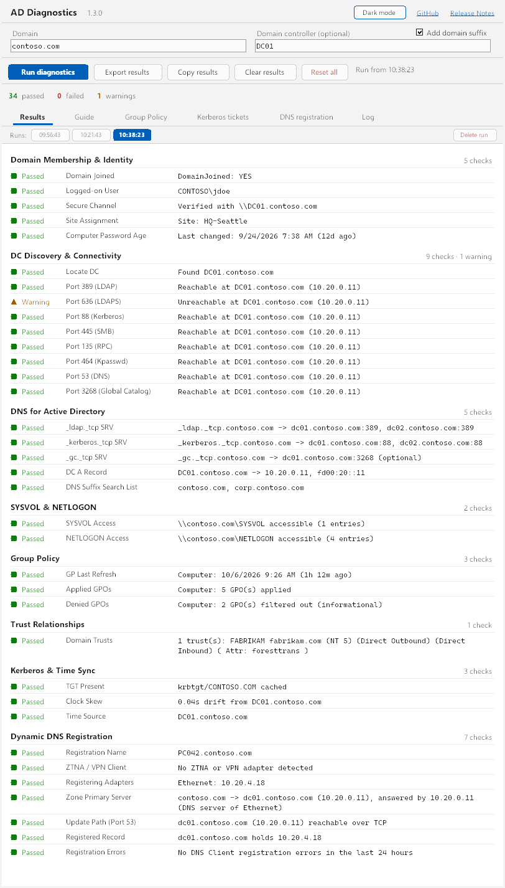
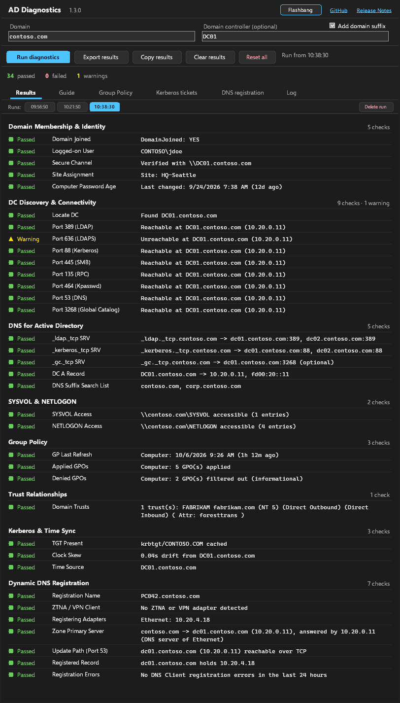
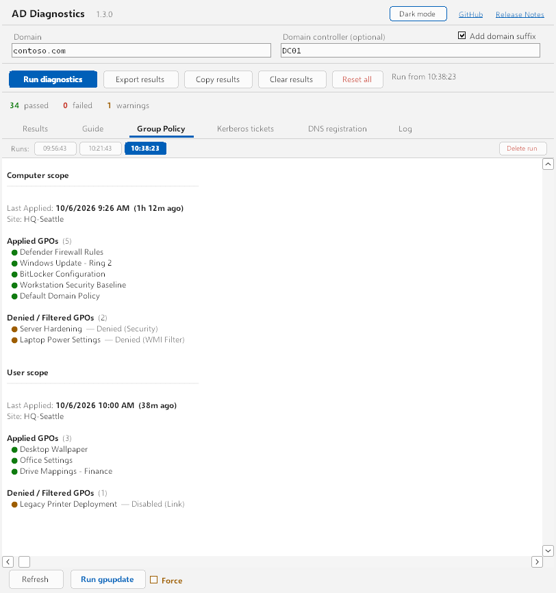
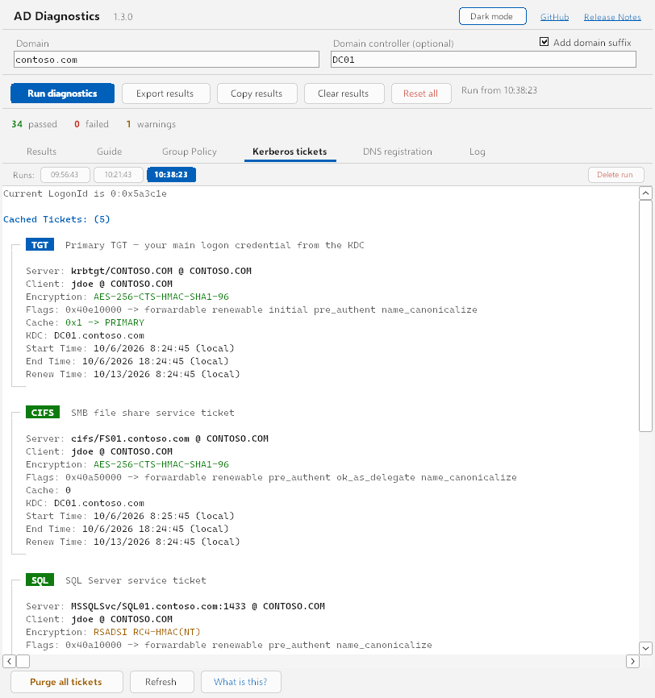
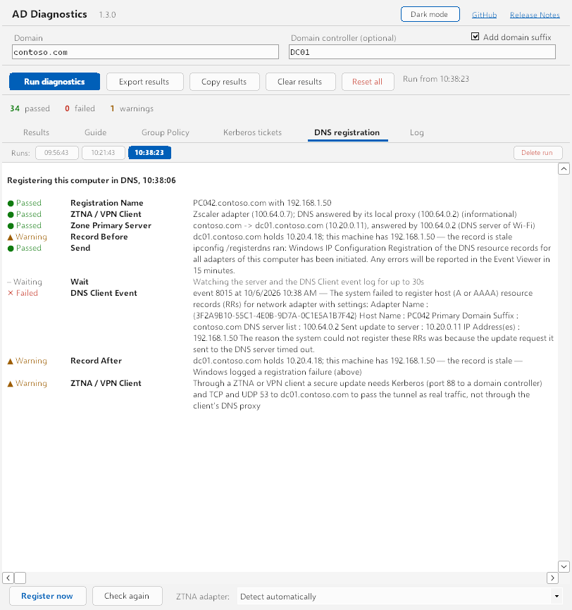
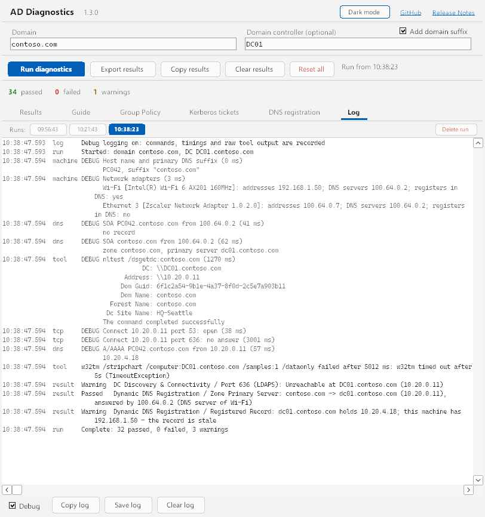

# AD Diagnostics

Standalone Windows diagnostic tool that checks the health of a domain-joined machine's relationship with Active Directory. Single-exe, no install required.

[GitHub](https://github.com/darthrater78/ad-diag) · [v1.3.0 release notes](https://github.com/darthrater78/ad-diag/releases/tag/v1.3.0)



The header button switches to **Dark mode**, and back to the light theme, **Flashbang**:



## Download

Grab `ad-diag-vX.Y.Z-win-x64.exe` from the [latest release](https://github.com/darthrater78/ad-diag/releases/latest). No installation — just run.

### Verifying a download

Each release includes a `.sha256` checksum file and a signed [build provenance attestation](https://docs.github.com/actions/security-for-github-actions/using-artifact-attestations) proving the exe was built by this repository's release workflow from the tagged source.

```powershell
# Checksum — compare against the .sha256 file from the release
Get-FileHash -Algorithm SHA256 .\ad-diag-vX.Y.Z-win-x64.exe

# Provenance (requires the GitHub CLI)
gh attestation verify .\ad-diag-vX.Y.Z-win-x64.exe --repo darthrater78/ad-diag
```

## Windows SmartScreen

On first launch, Windows SmartScreen may display a warning ("Windows protected your PC"). This is normal for unsigned executables from the internet. The app is not code-signed — it is a self-contained .NET 8 single-file executable built from the source in this repository. Click **More info** then **Run anyway** to proceed.

## Usage

1. Launch `ad-diag.exe`
2. The app auto-detects the current domain on startup (from `USERDNSDOMAIN`, `dsregcmd /status`, or the machine's DNS domain suffix) and pre-fills the **Domain** field if this machine is domain-joined. Enter target details:
   - **Domain** — e.g. `contoso.com`
   - **DC Hostname** — optional, defaults to domain for DC discovery. **+ domain suffix** is on by default, auto-appending the domain to short names. Uncheck to use the value as-is.
3. Click **Run Diagnostics** — results stream in as each test group completes
4. Review results, switch to the **Guide** tab for explanations and fix suggestions, the **Group Policy** tab for a full Computer/User scope breakdown and an in-app **gpupdate**, the **Kerberos Tickets** tab for your full ticket cache, the **DNS registration** tab to register this computer in DNS and trace the result, or the **Log** tab to see what the app ran

Up to 5 diagnostic runs are stored with timestamps — click any run to review it, or **Delete Run** to remove it.

- **Clear** — clears results and run history, keeps input fields
- **Reset** — clears everything including input fields
- **Export results** — saves a timestamped text report via Save dialog
- **Copy results** — puts the same report on the clipboard, for pasting into a ticket

## Security

### No credentials are stored or transmitted

The diagnostic run is **read-only**. Three actions change something, and each asks first: **Run gpupdate**, **Purge all tickets** and **Register now** (which asks Windows to register this computer's records in DNS). The app does not store, transmit, or log any credentials, tokens, or secrets.

- **Nothing is written to disk.** The app stores no settings, credentials, tokens, or diagnostic data on disk. All state exists only in memory for the current session. The only files it writes are the ones you save yourself: **Export results** and **Save log**.
- **Exported reports contain only metadata.** The text export includes test names and diagnostic details (trust names, GPO counts, port status). No raw tokens, password hashes, or credential material is included.
- **External process output is not persisted.** Output from `dsregcmd`, `nltest`, `klist`, `w32tm`, PowerShell queries, and other tools is parsed in memory for specific values only. The raw output is never written to disk, and is kept only while **Debug** is ticked on the Log tab (see below).
- **The log stays in memory.** The Log tab holds the last 5,000 lines until you clear it or close the app. With **Debug** on it includes raw tool output: host names, addresses, GPO names and Kerberos ticket details such as service names and encryption types (never keys or passwords). Read a debug log before sending it to anyone.

### Process isolation

- **Single instance enforced.** A per-session mutex prevents multiple instances from running simultaneously in the same logon session (other users on a shared host can run their own).
- **Nothing outlives the app.** Every external tool is started inside a Windows job object set to kill-on-close, so the tools end with the app however it exits (normal close, crash or End Task). On close, the in-flight diagnostic run is cancelled, the job is emptied and the process terminates itself outright rather than waiting on worker threads.
- **Every network call has a deadline.** DNS lookups (8s), SRV, SOA and host record queries (8s), TCP port checks (3s) and share access (20s) are bounded by the app, since Windows gives them no usable timeout. SYSVOL and NETLOGON are opened only after port 445 answers, so an unreachable domain fails in seconds. Clearing results or closing the app cancels a run: its tools are killed and no further ones start.
- **Input validation on all fields.** Domain and DC fields are validated against `^[a-zA-Z0-9.\-]+$`. No user input is passed to shell commands without validation.
- **No shell execution for diagnostics.** All external processes are launched with `UseShellExecute = false` and `CreateNoWindow = true`, and killed on timeout (a timeout is reported as a failure, never as a partial result).
- **No planted binaries.** Windows tools are launched by their full path in System32, and native DLLs (`dnsapi`, `netapi32`, `kernel32`) load only from System32, so a `klist.exe` or DLL placed next to a downloaded `ad-diag.exe` is never run, even when the app is elevated.
- **Links open unelevated.** The GitHub and Release Notes links accept only `https` URLs and open through `explorer.exe`, so the browser runs at the desktop's integrity level, never with the app's admin token.

## Test Groups

### 1. Domain Membership & Identity

Parses `dsregcmd /status`, `nltest`, `WindowsIdentity.GetCurrent()`, and AD via ADSI.

- **Domain Joined** — DomainJoined status from dsregcmd
- **Logged-on User** — current Windows identity (DOMAIN\user)
- **Secure Channel** — verifies the computer account's trust relationship via `nltest /sc_verify`
- **Site Assignment** — the AD site this client is assigned to, from `nltest /dsgetsite`
- **Computer Password Age** — queries the computer object's `pwdLastSet` attribute in the computer's own domain (which may differ from the target or logged-on user's domain); warns if stale (>45 days may indicate broken auto-rotation)

### 2. DC Discovery & Connectivity

Locates a domain controller and tests connectivity to required ports. Port checks run in parallel.

- **Locate DC** — `nltest /dsgetdc` finds the nearest available domain controller
- **Port 389 (LDAP)** — directory queries, group policy, logon
- **Port 636 (LDAPS)** — encrypted LDAP (optional)
- **Port 88 (Kerberos)** — KDC port, required for domain authentication
- **Port 445 (SMB)** — required for SYSVOL/NETLOGON share access and Group Policy download
- **Port 135 (RPC)** — RPC endpoint mapper, used for domain join and replication (optional)
- **Port 464 (Kpasswd)** — Kerberos password change protocol (optional)
- **Port 53 (DNS)** — AD-integrated DNS
- **Port 3268 (Global Catalog)** — forest-wide searches (multi-domain forests)

### 3. DNS for Active Directory

SRV records are queried with the Windows DNS API (`DnsQuery`), bypassing the resolver cache, and report the best target (lowest priority, highest weight) first.

- **_ldap._tcp SRV** — required for DC locator
- **_kerberos._tcp SRV** — required for KDC discovery
- **_gc._tcp SRV** (optional) — Global Catalog discovery in multi-domain forests
- **DC A Record** — resolves the target DC hostname to its IPv4 (A) and IPv6 (AAAA) addresses; port checks prefer IPv4 and fall back to IPv6
- **DNS Suffix Search List** — verifies the target domain is in the machine's DNS suffix list; a missing suffix causes short-name resolution failures

### 4. SYSVOL & NETLOGON

Tests access to the domain's SYSVOL and NETLOGON shares. These must be reachable for Group Policy to apply — a pass on port 389 but failure here is a classic troubleshooting scenario.

- **SYSVOL Access** — `\\domain\SYSVOL` reachability and read access
- **NETLOGON Access** — `\\domain\NETLOGON` reachability and read access

### 5. Group Policy

Reads the Resultant Set of Policy logging data from WMI (`root\rsop`), the same data `gpresult` reports. The last refresh time comes from the Group Policy engine's `State` registry key. Computer scope requires running as Administrator, as it does for `gpresult`.

- **GP Last Refresh** — how long since policy was last applied
- **Applied GPOs** — count of policies successfully applied
- **Denied GPOs** — policies filtered out by security filtering or WMI filters (informational)

### 6. Trust Relationships

- **Domain Trusts** — enumerates trust relationships via `nltest /domain_trusts`

### 7. Kerberos & Time Sync

- **TGT Present** — checks for a cached `krbtgt/REALM` ticket; if none is cached (e.g. in an elevated session, which has its own empty cache), requests one with `klist get` — either way proving KDC contact
- **Clock Skew** — measured via `w32tm` against the DC; Kerberos has a strict 5-minute tolerance
- **Time Source** — confirms the client is syncing from the domain hierarchy, not local CMOS

### 8. Dynamic DNS Registration

Checks whether this machine's own host record can reach, and is right on, the DNS server that owns its zone. These checks only read. SOA and host records are queried with the Windows DNS API on the wire, never from the resolver cache or the machine's own knowledge of its name.

- **Registration Name** — the name Windows registers: host name plus primary DNS suffix
- **ZTNA / VPN Client** (informational) — an adapter from a known client (Zscaler, Cloudflare WARP, Netskope, GlobalProtect, Twingate, Tailscale, Island, Microsoft Global Secure Access, Cisco, Fortinet and others), any other tunnel adapter, any other virtual (software) adapter that holds an address, an adapter with a `/32` address and no default gateway, addresses in `100.64.0.0/10`, or DNS answered by the client's local proxy. Hypervisor and loopback adapters are not counted. A client in "VPN mode" gives its adapter a real routable address, so detection does not depend on the address range
- **Registering Adapters** — connected adapters with "Register this connection's addresses in DNS" turned on and the addresses they would register; warns when one is a `100.64.0.0/10` tunnel address that no other host can route to, and notes when a client's adapter holds a routable address but has registration turned off
- **Zone Primary Server** — the zone and its primary server, found the way Windows finds where to send an update: the SOA record of the name, then of each parent, asked of the DNS servers of the adapters that register (IPv4 servers, in order; one that doesn't answer is passed over), not of whichever server the system resolver prefers. The detail names the server that answered. If no registering adapter has an IPv4 DNS server, the configured DNS servers are asked. Warns when the primary server resolves to a synthetic `100.64.0.0/10` address, or to a public address, which usually means the zone found is the internet-facing copy that takes no updates from this machine
- **Update Path (Port 53)** — TCP 53 to the primary server
- **Registered Record** — the A/AAAA records the primary server holds for this machine (asked directly; the configured DNS servers if it doesn't answer), compared with the addresses the machine has now
- **Registration Errors** — DNS Client warnings (event IDs in the 8000s) in the System log in the last 24 hours. Windows logs one per failed registration and nothing on success

**Behind a ZTNA client** the same failures have different causes, and the details say so: the client's DNS proxy can know a different zone than the registering adapter's own DNS server, which is why the zone is looked up through the latter; a DNS proxy that answers A/AAAA/SRV but not SOA leaves Windows unable to find where to send an update; a primary server with a synthetic address is reachable only if the client forwards port 53 for it; and a policy that carries DNS queries doesn't necessarily carry updates, which also need Kerberos (port 88) to a domain controller.

## Group Policy Tab



A dedicated tab (separate from the streaming diagnostics above) that reads the Resultant Set of Policy (see above) into a readable, color-coded breakdown:

- **Computer and User scope**, each showing:
  - Last applied time, with age and a staleness warning past 7 days
  - AD site name
  - Every **applied** GPO
  - Every **denied/filtered** GPO with its filtering reason (security filtering, WMI filter, disabled link, etc.)
- **Refresh** — re-queries the policy results and re-renders the tab
- **Run gpupdate** — runs `gpupdate` (or `gpupdate /force` with the **Force** checkbox) directly from the app, with a confirmation dialog explaining the impact of Force (reapplies all policies, not just changed ones; can briefly disrupt mapped drives/printers; may require a restart for some extensions). Automatically refreshes the tab afterward.

## Kerberos Tickets Tab



A dedicated tab that parses `klist` and renders every cached Kerberos ticket with color-coded service type badges:

- **TGT** — Ticket Granting Ticket (your master KDC credential). Shows PRIMARY vs DELEGATION cache flags.
- **CIFS** — SMB file share service tickets
- **LDAP** — Directory service tickets
- **HOST** — Remote admin / WinRM tickets
- **HTTP** — Web service tickets (ADFS, Exchange, etc.)
- **RDP** — Remote Desktop (TERMSRV) tickets
- Plus SQL, DNS, Exchange, and any other service types

Each ticket card shows: server, client, encryption type (AES = green, RC4 = yellow warning), flags, cache type, KDC called, and start/end/renew times with expiry detection.

- **Purge All Tickets** — runs `klist purge` with confirmation dialog
- **Refresh** — re-reads the ticket cache
- **What is this?** — toggles an in-app explainer covering ticket types, encryption, and what purge does

## DNS Registration Tab



Sends a dynamic DNS registration and traces what happens to it.

- **Register now** — after a confirmation, runs `ipconfig /registerdns`, so the DNS Client service sends the update as the computer account, exactly as Windows does on its own. Requires running as Administrator; without it nothing is sent. The service works in the background and reports nothing on success, so the app then watches, for up to 30 seconds, the two places the outcome shows: the record on the zone's primary server (before and after) and the DNS Client's failure events. A failure event fails the trace even if the record looks right. If nothing has changed and nothing is logged, the result is "not confirmed", since Windows can take longer.
- **Check again** — repeats the read-only checks from group 8 without sending anything.
- **ZTNA adapter** — for a client the app does not detect. Lists every connected adapter that holds an address, with the signals seen on it (`tunnel`, `virtual`, `/32, no gateway`); pick the client's adapter and every ZTNA hint applies as if it had been detected, here and in Run Diagnostics. **None** overrides a false detection. The choice is not saved: it lasts until the app closes.

Every step is also written to the log.

## Log Tab



What the app did and what came back, newest at the bottom. Without **Debug** it records each run, every result, the DNS registration steps and any tool or query that failed. With **Debug** ticked it also records each command, DNS query (with the server it was sent to) and port check with its duration and raw output, and the Windows error number behind a failure. A script that runs again unchanged is logged once, and connected adapters that hold no address share one line. Debug is off at every start.

- **Copy log** / **Save log** — the whole log as text, to the clipboard or to a file you choose
- **Clear log** — empties it

## Architecture

**Runtime:** .NET 10 WinForms, self-contained single-file executable (win-x64, ReadyToRun-precompiled for faster startup).

**Structure:** `MainForm.cs` holds the UI and the Windows-specific calls; `Diagnostics.cs` and `DnsRegistration.cs` hold the eight test groups and the traced DNS registration, which reach the machine only through the `IProbe` interface so they can be tested against a fake; `Log.cs` holds the in-memory log and the wrapper that logs every `IProbe` call; `Runner.cs` runs tools and network calls with deadlines; `Parsers.cs` holds the pure parsers for tool output (`klist`, `nltest`, `w32tm`, and the app's PowerShell queries), kept free of WinForms so they can be unit tested on any platform.

**UI:** Owner-drawn `Panel` with `TextRenderer.MeasureText` for word-wrapped results. Starts in the Windows light or dark app setting; the header button switches between **Dark mode** and the light theme, **Flashbang**, at any time (the choice is not saved, since the app writes nothing to disk). Scales with the display DPI; every status has its own shape as well as its own colour, and each result row is exposed to screen readers as a list item. The design rules are in [DESIGN.md](DESIGN.md). Test groups stream results in real-time as each completes.

**Non-English Windows:** tool output is translated on localized Windows, so parsers anchor on structure, numeric status codes and symbolic names (e.g. `Status = 1311 0x51f ERROR_NO_LOGON_SERVERS`) rather than English labels, and output is decoded in the console's OEM code page so non-ASCII names aren't garbled. `klist`'s translated field labels are identified by their fixed position in each ticket. Group Policy (RSoP) and DNS lookups (`DnsQuery`) use APIs rather than tool output, so they're language-neutral too. DNS Client events are matched by ID; their text is shown as Windows wrote it.

**Input Validation:**
- `HostnamePattern`: `^[a-zA-Z0-9.\-]+$` — domain and DC fields

**Settings:** None — no data is persisted to disk. The app auto-detects the domain on startup.

### External Process Calls

| Process | Purpose | Timeout |
|---|---|---|
| `dsregcmd /status` | Domain join state (and startup domain auto-detect) | 15s (5s at startup) |
| `nltest /sc_verify` | Secure channel verification | 10s |
| `nltest /dsgetsite` | AD site assignment | 5s |
| `nltest /dsgetdc` | DC locator | 8s |
| `nltest /domain_trusts` | Trust enumeration | 8s |
| `gpupdate` / `gpupdate /force` | Manual policy refresh (Group Policy tab) | 90s |
| `klist` | Kerberos ticket cache (diagnostics + tab) | 5s |
| `klist get krbtgt/REALM` | Request a TGT when none is cached | 10s |
| `klist purge` | Purge cached tickets (Kerberos Tickets tab) | 5s |
| `w32tm /stripchart` | Clock skew measurement | 5s |
| `w32tm /query /source` | Time source | 5s |
| `powershell` (DirectorySearcher) | Computer password age from AD | 15s |
| `powershell` (Get-CimInstance, `root\rsop`) | Group Policy results (diagnostics + tab) | 25s |
| `powershell` (Get-WinEvent, System log) | DNS Client registration failures (diagnostics + DNS registration tab) | 15s |
| `ipconfig /registerdns` | Register in DNS (DNS registration tab) | 20s |

All launched with `CreateNoWindow`, `UseShellExecute=false`, redirected stdout/stderr, and stdin closed (so a tool that prompts gets EOF instead of hanging). On timeout the process tree is killed and the test reports the timeout; the same deadline covers a tool that exits but leaves its output pipe open.

## Build from Source

Requires [.NET 10 SDK](https://dotnet.microsoft.com/download/dotnet/10.0).

```
git clone https://github.com/darthrater78/ad-diag.git
cd ad-diag
dotnet publish -c Release -r win-x64 --self-contained true
```

Output: `bin/Release/net10.0-windows/win-x64/publish/ad-diag.exe`

Run the parser tests (works on Windows, Linux or macOS):

```
dotnet test tests/AdDiag.Tests
```

The tests use representative tool output (mostly English, with some German) in `tests/AdDiag.Tests/Samples.cs`. When a parser misreads real output, add that output as a sample and a test.

The README screenshots are generated from mock data by `tools/screenshots/run.sh` (Linux, under Wine). See [tools/screenshots/README.md](tools/screenshots/README.md).

## Releasing

Bump `<Version>` in `AdDiag.csproj` and add a row to [Version History](#version-history), merge to `main`, then push a tag of the form `vMAJOR.MINOR.PATCH` (or `vMAJOR.MINOR.PATCH-rc1` etc. for a prerelease). The release workflow refuses a tag that isn't on `main` (prereleases excepted), hasn't passed CI, or doesn't match `<Version>`. It builds with the version from the tag, so the in-app badge and file version always match it, and uses the tag's Version History row as the release notes. A final release with no row fails before building; prereleases get GitHub's generated notes only. CI builds every push to any branch (and pull requests from forks), and attaches the built `ad-diag.exe` to the run (kept 14 days) for testing before a release; a change that touches only documentation (Markdown, `docs/`, screenshots) skips the build. Those builds are not release builds: they have no checksum file or provenance attestation, and they report the version in `AdDiag.csproj`. CI also runs the unit tests (parsers, the eight diagnostic groups and the DNS registration trace against a faked machine, the log, and the process and network runner that enforces the deadlines) and builds the screenshot harness. Pull requests also run CodeQL, dependency review (fails on a High or Critical advisory), and actionlint when workflows change.

## Version History

| Version | Date | Changes |
|---|---|---|
| v1.3.0 | 2026-10-06 | New test group, **Dynamic DNS Registration**: the name Windows registers, the adapters that register it, the zone's primary server (found by SOA through the registering adapters' own DNS servers, with the answering server named), TCP 53 to it, the record it holds compared with the machine's addresses, and DNS Client registration errors from the last 24 hours. A primary server with a public or synthetic `100.64.0.0/10` address warns. New **DNS registration** tab: **Register now** runs `ipconfig /registerdns` after a confirmation (Administrator only) and traces the outcome on the primary server and in the DNS Client's failure events; **Check again** repeats the read-only checks. ZTNA and VPN clients are detected by name, tunnel type, virtual adapter, a `/32` address with no gateway, `100.64.0.0/10` addresses or a local DNS proxy, and the failure details say what the client changes; a **ZTNA adapter** picker tags one by hand or overrides a false detection. New **Log** tab: runs, results, registration steps and failures, plus commands, queries, timings and raw output with **Debug** ticked; copy, save or clear it. The log is held in memory and nothing is written unless you save it |
| v1.2.0 | 2026-10-05 | No more hangs when the domain is unreachable: DNS, SRV, port and share checks all have deadlines, and SYSVOL/NETLOGON are opened only after port 445 answers. Closing the app or clearing results cancels the run, tools can no longer outlive the app (kill-on-close job object), and `ad-diag.exe` no longer lingers after its window closes. New look: native Windows styling with a Dark mode / Flashbang (light) switch that starts from the Windows setting, a results grid whose status marks differ by shape as well as colour, plain-text details, per-group counts, and DPI scaling. New **Copy results** button; Enter starts a run; each result row is exposed to screen readers. Fixed `&` missing from group headers and overlapping text in the header and summary. Moved to .NET 10. CI builds every branch, skips docs-only changes, and tests the process and network runner |
| v1.1.0 | 2026-09-27 | Works on non-English Windows: Group Policy is read from RSoP (WMI) instead of `gpresult` text, SRV records via `DnsQuery`, and `nltest`/`klist`/`w32tm` output parsed by structure and status codes, not English labels; a broken secure channel no longer passes on localized Windows. TGT Present requests a ticket when none is cached (elevated sessions); Computer Password Age queries the computer's own domain; DNS and port checks support IPv6-only DCs. Tool timeouts are reported as failures, prompting tools no longer hang, and running tools are killed on exit. Trust enumeration excludes the machine's own domain and warns when `nltest` fails. Windows tools are launched by full System32 path and native DLLs load only from System32, so copies planted next to the exe are never run; header links open unelevated, and Release Notes links to this version's notes. Release pipeline: CI with parser tests, SHA-pinned actions, checksum and provenance attestation, CodeQL and dependency review |
| v1.0.2 | 2026-07-16 | Release asset is now a single self-contained exe (no zip); native libraries are bundled into the single file; fixed the in-app version badge, which was hardcoded and had gone stale |
| v1.0.1 | 2026-07-16 | Fixed 10 correctness bugs: wrong rows shown as running, crash or corrupted history when deleting a run mid-flight, Clear Results not stopping the run, `klist` Client and Ticket Flags fields dropped, Group Policy and Results tabs disagreeing on GPO counts, gpupdate garbling the Group Policy tab, a stuck Group Policy guard, a faulted test group crashing the app, and unobserved exceptions from abandoned TCP connects |
| v1.0.0 | 2026-07-14 | Initial release — domain membership (including computer password age from AD), DC discovery with 8 port checks (LDAP, LDAPS, Kerberos, SMB, RPC, Kpasswd, DNS, Global Catalog), AD DNS SRV records and suffix search list, SYSVOL/NETLOGON share access, Group Policy status, trust relationships, Kerberos ticket and time sync diagnostics; Group Policy tab with Computer/User scope breakdown and in-app gpupdate; Kerberos Tickets tab with full ticket cache viewer, purge, and explainer; auto-detects domain on startup; elevation-aware warnings |
